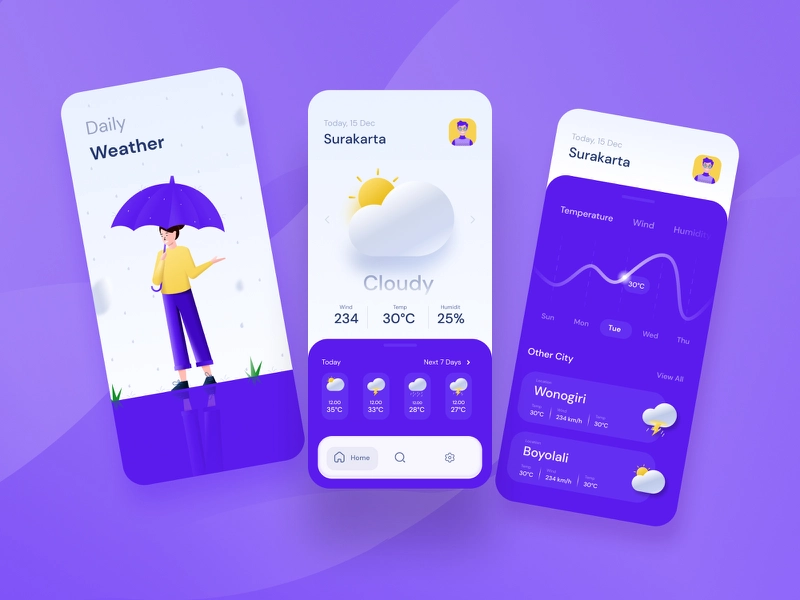

# Weather Forecast App 👋


[](#)

 


A Weather Forecast App built with Flutter

# Flutter Version
Flutter 2.5


# 💻 Requirements

- Any Operating System (ie. MacOS X, Linux, Windows)
- Any IDE with Flutter SDK installed (ie. IntelliJ, Android Studio, VSCode etc)
- A little knowledge of Dart and Flutter

# Screenshots


 


# Command
### Install dependencies

```sh
flutter pub get
```

### Run application

```sh
flutter emulators --launch <emulator_name>
flutter run
```

### Build

```sh
flutter build apk
```

# Plugins
- [flutter_screenutil](https://pub.dev/packages/flutter_screenutil)
- [google_nav_bar](https://pub.dev/packages/google_nav_bar)
- [mvc_pattern](https://pub.dev/packages/mvc_pattern)
- [lottie](https://pub.dev/packages/lottie)
- [gradient_widgets](https://pub.dev/packages/gradient_widgets)
- [fluttericon](https://pub.dev/packages/fluttericon)
- [fl_chart](https://pub.dev/packages/fl_chart)


## DribBble Link
[Dribble](https://dribbble.com/shots/14807515-Daily-Weather-Prediction)
 


## Author

👤 **Flutter BoyFriend**

* Github: [@FlutterBoyfriend](https://github.com/FlutterBoyfriend)

## Show your support

Give a ⭐️ if you like this project! all contributions 👏✍ and PRs 🖖🤞 are welcome 🤝🙏
you can also create issues if you detect any bug 🦟🦟 

